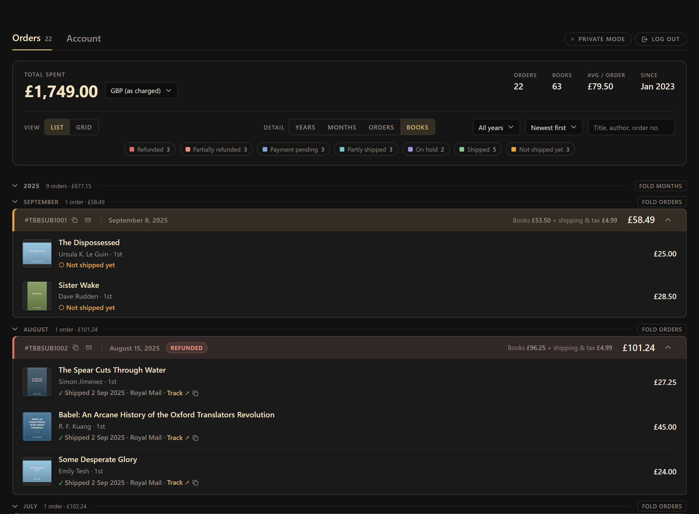
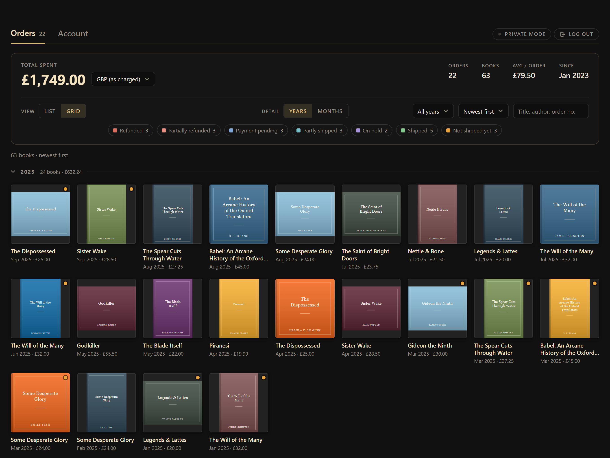
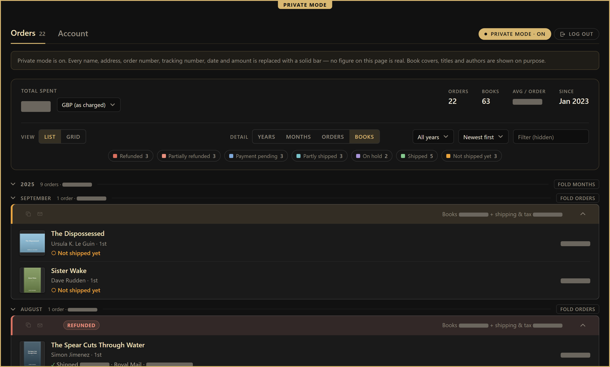
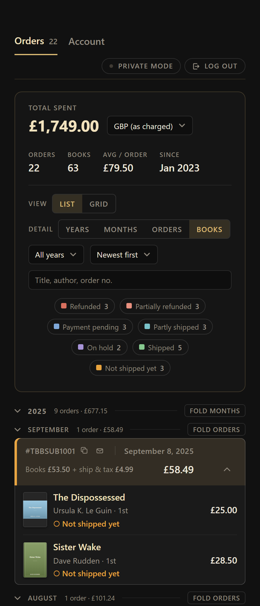

# Broken Binding Specials & Subscriptions Extension

A browser enhancement for [The Broken Binding](https://thebrokenbindingsub.com/). Today it
focuses on your account page — rewriting the built-in order history into a single, fast,
filterable view, with no clicking through pages. A better view for browsing the store is
planned.

Everything runs in your own browser, using the login you already have. Nothing is
sent anywhere except the shop's own site and two public exchange-rate APIs (for the
optional currency conversion). The only actions that ever change anything are the two
address controls on the Account tab, and only when you click them.

## What it does

- **One continuous list.** Every page of your order history is merged into a single
  view, so all your orders are in one place.
- **Summary card.** Total spent, order count, book count, average per order, and how
  far back your history goes — all recomputed live as you filter.
- **Per-order detail.** Expand any order to see covers, titles, authors, printing,
  shipping, and tracking numbers.
- **Grid view.** Every book you've ever ordered as a wall of covers, grouped by year
  and month, with best-fit thumbnails.
- **Filters.** By year, by month, by status (shipped, refunded, …), by free text, and
  a newest/oldest sort — in both the list and the grid.
- **Currency conversion.** See totals in your own currency, converted at the exchange
  rate *on each order's date* (ECB fixings via Frankfurter) or at today's rate. The
  basis picker hides itself for currencies that only support one.
- **Account tab.** Your saved shipping addresses as cards, with the ability to add or
  remove one — including the reminder that a new address doesn't change existing orders.
- **Private mode.** One click redacts every name, address, order number, tracking
  number, date, and price, so you can share your screen safely.

## Screenshots

Everything below runs against a test fixture — the orders, totals and cover art are
invented, not anyone's account.

### One continuous list

Every page of the history merged into a single view, folded by year and month, with
each order's books, shipping and tracking underneath it, and the totals recomputed as
you filter.

### Every book, as a wall of covers

The same filters and totals, drawn as a grid instead of a list.

### Private mode

One click replaces every name, address, order number, tracking number, date and amount
with a solid bar, so the page is safe to put on a shared screen. Covers, titles and
authors stay — they are the part worth showing.

### On a phone

## Install

You need a userscript manager: [Tampermonkey](https://www.tampermonkey.net/),
[Violentmonkey](https://violentmonkey.github.io/), or Greasemonkey (Firefox).

1. Install one if you don't already have it.
2. Open **[broken-binding-se-ext.user.js](https://raw.githubusercontent.com/TheDigitalLibrarian/broken-binding-se-ext/main/dist/broken-binding-se-ext.user.js)**
   — your manager will recognise it and offer to install.
3. Visit `thebrokenbindingsub.com/account`. The extension loads by itself.

Installing from that link lets your manager check the same URL for later versions.
To update by hand, open the link again and accept the reinstall.

### Bookmarklet

No manager needed. It runs when you click it, rather than on every visit.

1. Open **[bookmarklet.txt](https://raw.githubusercontent.com/TheDigitalLibrarian/broken-binding-se-ext/main/dist/bookmarklet.txt)**
   and copy the whole line.
2. Make a new bookmark and paste it as the URL (address/location).
3. On your account page, click the bookmark.

It is one very long line — the whole extension, minified and URL-encoded — so select
all of it. Paste it into the bookmark manager's URL field rather than the address bar,
which truncates. Being a copy, it does not update itself; to take a newer version,
paste over the old one.

## Privacy & safety

- Read-only except the Add/Remove address buttons on the Account tab.
- Order and address data stays in your browser. The only outbound calls are to the
  shop itself and, for conversion, `api.frankfurter.dev` and `open.er-api.com`.
- Private mode is for screen-sharing; it redacts the display only and changes nothing.

## Contributing

Project layout, the build, the test suite and the release process are in
[CONTRIBUTING.md](CONTRIBUTING.md). Version history is in [CHANGELOG.md](CHANGELOG.md).
